  

---

## 🔭 About Me

- 🎓 2nd Year B.Tech CSE student with 2+ years of coding experience.  
- 📱 Building Android apps with a focus on privacy and performance.
- 🤝 Always open to collaboration, feedback, and fun challenges
- 📫 Reach me at: [vadityamishra777@gmail.com](mailto:vadityamishra777@gmail.com)
## 🌱 Currently Learning
- Android Security
- Jetpack Compose
- Backend APIs
- System Design
---

## 🛠 Tech Stack

## 📱 Android 

  
  

### 🌐 Web Development

### ⚙ Backend & Cloud

### 🐧 Systems & Tools

## 📚 Android Technologies

## 🔗 Connect with Me

## 📊 GitHub Stats:

  

  

## 📊 Developer Dashboard

 
## 💻 Development Metrics

---

## 📈 Contribution Graph

## 🐍 Snake Eating My Contributions

